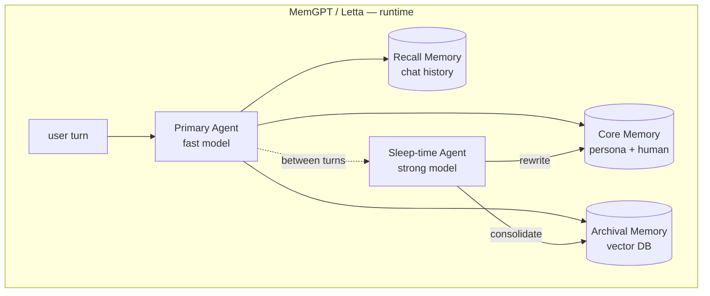
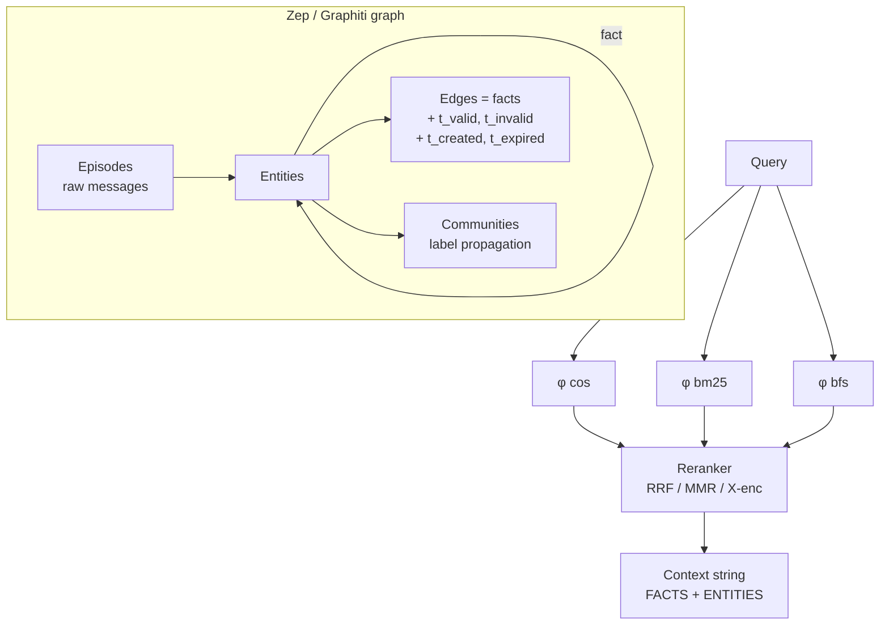
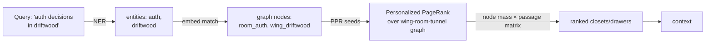

# Agent Memory Architectures — Research Survey (2024–2026)

> Scope: a deep, opinionated survey of the cutting-edge agent-memory literature and shipping
> systems, written to inform a concrete upgrade of `mempalace_rust`. For each system: core
> abstraction, storage model, retrieval, update / forgetting, benchmarks, what's the moat vs.
> what's gimmicky, and what mempalace_rust could actually adopt.
>
> Sources are cited inline (arXiv IDs, vendor docs, engineering blogs). Where claims came from
> vendor marketing, that is flagged. Where the claim contradicts a reproduced result, the
> contradiction is noted.

---

## TL;DR

The 2024–2026 wave converged on a clear taxonomy. There are essentially **four moats** in agent
memory today, and everything else is plumbing or marketing:

1. **Structured retrieval over a knowledge graph** (Zep/Graphiti, HippoRAG2, Mem0g) —
   the +10–20pt LongMemEval/LoCoMo wins all come from here, especially for multi-hop and
   temporal questions.
2. **Bi-temporal validity** (Zep) — separating "when was it true in the world?" from "when did
   we learn it?" is the only thing that handles knowledge updates, contradictions, and "what
   did we believe last March?" correctly.
3. **A specialized retrieval algorithm over the graph** — Personalized PageRank (HippoRAG /
   HippoRAG2) is the only retrieval method that consistently produces single-step multi-hop
   recall. Everything else either pays N× LLM round-trips or falls back to flat kNN.
4. **Sleep-time / asynchronous memory consolidation** (Letta, A-MEM, MemoryBank's reflection,
   Cognitive Weave's IA synthesis, Generative Agents' reflection) — moving the expensive
   "what's important?" computation off the critical path is the only way to make memory
   organization not blow up latency.

The rest — vector DBs with metadata filters, hierarchical "core/recall/archival" tiers,
"insight particles", "spatio-temporal resonance graphs", forgetting curves, file-based memory
tools — is mostly engineering taste, not measured performance gain. Useful, but not moats.

For mempalace_rust specifically, the highest-ROI upgrades are (in order):
1. Add **bi-temporal validity** to the SQLite knowledge graph (currently single-timestamp).
2. Add **Personalized PageRank** retrieval over wing/room/drawer + entity nodes (currently
   wing/room are filters, not a graph search).
3. Add **sleep-time consolidation** for closet summaries (currently produced eagerly during
   mining, not refined later).
4. **Truth-in-marketing fix on AAAK**: the Rust impl in `crates/core/src/dialect.rs` already
   states `"AAAK is lossy. ... the original text cannot be reconstructed from AAAK output"`,
   yet the README claims "30x compression, zero information loss." That's a measurable
   contradiction; details in §15.

Detailed analysis below.

---

## 1. MemGPT / Letta

**Core abstraction.** Treat the LLM context window as RAM and external storage as disk;
expose system calls (`memory_edit`, `memory_search`, `pagein`, `pageout`) so the model can
manage its own paging. The original 2023 paper (arXiv:2310.08560) framed this as "LLMs as
operating systems." Letta (2024–2026) is the productized successor — same authors (Charles
Packer et al., UC Berkeley → Letta), now an agent runtime with persistent memory, tools,
and a multi-tenant database backend.

**Memory hierarchy** (the textbook description):
- **Core memory** — small, in-context, always visible. Two blocks: `persona` (agent identity)
  and `human` (facts about the user). Rewritten by the model when ~90% full.
- **Recall memory** — full conversation history, searchable, paged in on demand.
- **Archival memory** — long-term store (vector-backed in practice) for summaries, documents,
  and learned facts.

**Storage model.** Postgres (Letta cloud) or SQLite (local). Vector index inside the same DB
for archival. Memory blocks are first-class rows; agents are serialized to a `.af` file format.

**Retrieval.** kNN on archival, full-text + recency on recall, system-prompt injection of core.
There is no graph traversal.

**Update / forgetting.** Two mechanisms:
- The agent itself rewrites core memory blocks via tool calls when they fill up.
- **Sleep-time compute** (Letta blog, Apr 2025; arXiv:2504.13171). A separate "sleep-time
  agent" runs asynchronously between user turns. It has the memory-edit tools that the
  primary agent does not, so the primary agent stays fast and the sleep-time agent quietly
  reorganizes memory in the background. Letta found you can use a stronger/slower model for
  the sleep-time agent (Sonnet, GPT-4.1) while the user-facing agent stays on a fast model.

This is genuinely novel and has been adopted, in spirit, by MIRIX (multi-agent memory
managers), A-MEM (memory evolution), and Cognitive Weave (refinement loop).

**Benchmarks.**
- DMR (Deep Memory Retrieval, MemGPT's own benchmark): 93.4% on gpt-4-turbo per the original
  paper; Zep beat it 94.8%.
- LongMemEval: MemGPT's framework cannot ingest pre-existing message history out of the box.
  The Zep paper (arXiv:2501.13956) explicitly reports they "were unable to achieve successful
  question responses" using MemGPT's archival workaround. So MemGPT/Letta does *not* have a
  reliable LongMemEval number.
- LoCoMo (Letta blog, Aug 2025, "Is a Filesystem All You Need?"): **74.0% on LoCoMo** with
  Letta Filesystem — a filesystem-backed memory beating specialized memory libraries.

**What's the moat.** Sleep-time compute and the OS metaphor. The OS metaphor is durable
because it gives a clean mental model and an upgrade path (any new "storage" backend slots
in like a new mount). Sleep-time is the most cited new idea from this lineage.

**What's gimmicky.** The strict three-tier (core/recall/archival) split is mostly cosmetic — in
practice Letta agents page everything through the same vector store. Letta's 2025 pivot to
Letta Code (a coding agent) is downstream brand work, not a memory-architecture change.

**What mempalace_rust could adopt.**
- **Sleep-time consolidation worker** — spawn a background task that periodically re-mines
  closets (refine summaries, re-link rooms, recompute hall_facts importance). Currently
  mempalace builds closets eagerly during `mpr mine`; nothing improves them later.
- **Memory blocks as a primitive** — the current "identity.txt" + wing_config.json could be
  unified into a `memory_blocks` table with size limits and an LLM-rewrite tool. This makes
  the L0 (identity) and L1 (critical facts) layers programmatically editable rather than
  text files.



---

## 2. A-MEM (Agentic Memory with Zettelkasten)

**Core abstraction.** Treat each new memory as a Zettelkasten note: when added, the agent
writes a structured note (context, keywords, tags), and *then* the system asks the LLM to
find which existing notes it should link to. Crucially, adding a note can also trigger
**memory evolution** — updating the descriptions/tags of older linked notes in light of
the new one. NeurIPS 2025; arXiv:2502.12110.

**Storage model.** Vector store + linked notes (graph emerges implicitly). The graph is
materialized as edges in the same store.

**Retrieval.** Standard kNN over note embeddings; the graph mostly serves the writing path,
not the reading path.

**Update / forgetting.** **Memory evolution** is the hook. When a new note links to old
ones, the old notes' summaries can be rewritten to incorporate the new context. There is
no explicit forgetting; relevance decays implicitly through retrieval frequency.

**Benchmarks.** A-MEM reports superior performance vs. MemGPT, basic RAG, and Mem0 across
six foundation models on LoCoMo (paper Tables 2–3). Mem0's 2025 paper, however, shows
A-MEM trailing Mem0g on LoCoMo by ~10 points on overall LLM-as-judge score. MIRIX's 2025
paper has A-MEM at 18.85% multi-hop / 48.38% overall on LOCOMO with gpt-4o-mini, well below
the SOTA — so the absolute numbers depend heavily on backbone choice.

**What's the moat.** Memory evolution. The idea that adding a note changes the semantic
content of existing notes (not just the link structure) is a real generalization beyond
graph-RAG and is rarely implemented elsewhere. It's the closest thing to "the memory
system actually learns" in this corner of the literature.

**What's gimmicky.** The Zettelkasten branding. Zettelkasten was a paper-based note-linking
practice; calling LLM-prompted note-linking "Zettelkasten" is mostly aesthetic. The
mechanism is "LLM proposes links + LLM rewrites neighbor summaries," which is independently
sensible.

**What mempalace_rust could adopt.**
- **Closet evolution.** When a new drawer is added to a room, run a small LLM pass that
  may rewrite the closet summary of *neighboring* rooms (linked via tunnels). Currently
  closets are static once written. This is a direct port of A-MEM's evolution mechanism
  onto mempalace's wing/room/closet topology.
- **Auto-link generation at write-time.** Currently mempalace builds tunnels by name match
  ("auth-migration" appears in two wings → tunnel). A-MEM's writer-time link prompt could
  catch semantic tunnels (e.g., "OAuth migration" in wing_kai vs. "Clerk decision" in
  wing_driftwood) that name-matching misses.

---

## 3. Mem0 / Mem0g

**Core abstraction.** A managed memory layer that sits between your agent and an LLM. New
turns are passed through an **LLM-driven extraction pipeline** that decides what to ADD,
UPDATE, DELETE, or NOOP against the existing memory store. arXiv:2504.19413; updated
algorithm on mem0.ai blog (state-of-ai-agent-memory-2026, Nov 2025).

**Two variants:**
- **Mem0** — flat store of extracted facts (vector index over fact strings).
- **Mem0g** — same extraction, but facts are also turned into a graph (entities + typed
  edges). Optional, ~2% accuracy lift on LoCoMo per the paper.

**Storage model.** Vector DB (Qdrant, pgvector, etc.) for facts; optional Neo4j or in-process
graph for Mem0g. Production deployment uses the cloud.

**Retrieval.** kNN over fact embeddings, optionally fused with graph 1–2 hop expansion.

**Update / forgetting.** This is Mem0's central trick. Every new turn → LLM call that
proposes operations on the memory bank: ADD a new fact, UPDATE an existing one (with the
old fact's vector ID), or DELETE if contradicted. Token-efficient memory algorithm
(announced Nov 2025) reportedly hits LongMemEval 94.4 / LoCoMo 92.5 at ~6,900 tokens per
query. The LLM-driven extraction is what makes Mem0 expensive at scale — every conversation
turn pays an LLM call, but writes are batched and amortized.

**Benchmarks.** This is where vendor numbers diverge dramatically:
- Mem0 (vendor, Apr 2025): "26% relative improvement over OpenAI memory; 91% lower p95
  latency vs. full-context."
- Zep (Mem0-alternative blog post, Dec 2025): re-ran LoCoMo and got Zep at **75.14% J**
  vs. Mem0g's best at ~**65%** — about 10 points the other way. They explicitly accuse
  Mem0's published numbers of methodology issues.
- Mem0 (Nov 2025 self-report): **94.4 LongMemEval / 92.5 LoCoMo** with new algorithm.
- MIRIX paper (Jul 2025): Mem0 ~67% overall on LOCOMO; well behind MIRIX's 85%.

**Treat published Mem0 numbers as ceilings, not central tendencies.** The variance across
re-implementations is larger than the differences they claim to measure.

**What's the moat.** The LLM-as-extractor approach is genuinely different from passive
RAG, and the production-grade SDK + integrations (LangGraph, AutoGen, etc.) is the real
moat. Architecturally, Mem0g is fairly conventional graph-RAG.

**What's gimmicky.** The graph variant's claimed wins are small (~2%) for substantial
operational complexity (Neo4j, etc.). The "fact-extraction-with-LLM" pattern, while
effective, is also expensive — Mem0 can chew through tokens during heavy ingestion.

**What mempalace_rust could adopt.**
- **ADD/UPDATE/DELETE extraction loop.** Currently mempalace's mining is one-pass — it
  produces drawers and closets, but nothing reconciles a new closet with an existing
  contradictory one. A `cmd_mine` post-pass that asks the LLM "which existing closets,
  if any, does this new closet UPDATE or DELETE?" would close that gap.
- **Note that mempalace's KG already does this for triples** — `add_triple` auto-invalidates
  conflicting triples. The same pattern applied at the closet level would catch
  "Maya is on auth migration" → later → "Maya finished auth migration" without manual
  cleanup.

---

## 4. Zep / Graphiti

**Core abstraction.** A temporally-aware knowledge graph that ingests both unstructured
chat and structured business data, dynamically extracts entities + relationships + temporal
facts, and serves retrieval through fused semantic + BM25 + breadth-first graph search.
arXiv:2501.13956. Graphiti is the open-source engine; Zep is the commercial wrapper.

**The graph has three tiers:**
- **Episodic subgraph** — raw input messages/text/JSON, non-lossy.
- **Semantic subgraph** — extracted entities and facts; entity-resolution at write time.
- **Community subgraph** — clusters of related entities (label-propagation algorithm) with
  LLM-generated summaries; conceptually similar to GraphRAG's communities.

**Storage model.** Neo4j by default. Bi-directional indices between episodes ↔ extracted
facts so any retrieved fact can be traced back to its source utterance.

**Retrieval.** Three search functions composed:
- `φ_cos` — cosine semantic similarity (over Lucene/Neo4j vectors)
- `φ_bm25` — Okapi BM25 full-text
- `φ_bfs` — breadth-first graph traversal from seed nodes

Then a reranker: RRF, MMR, episode-mention frequency, node-distance from a centroid, or
LLM cross-encoder. Output is a context string that names facts, entities, and validity
ranges.

**The bi-temporal model.** Every fact (edge) carries four timestamps:
- `t'_created`, `t'_expired` — transactional times (when did Zep learn / unlearn this).
- `t_valid`, `t_invalid` — domain times (when was this true in the world).

When a new fact contradicts an old one, an LLM compares them and sets the old edge's
`t_invalid = t_valid` of the new edge. Historical queries (`as_of=2025-03-01`) work
correctly because both timelines are preserved separately. **This is the single most
important idea in this whole list for any system that has to handle "the user changed their
mind" or "the policy changed in March."**

**Update / forgetting.** Edge invalidation by temporal contradiction, plus periodic
community refresh (label propagation is incremental but drifts; full reruns are still
needed). No explicit forgetting curve; old edges stay invalid-but-readable forever.

**Benchmarks.**
- DMR: **94.8%** with gpt-4-turbo (vs. MemGPT 93.4%); 98.2% with gpt-4o-mini.
- LongMemEval-S: **18.5%** absolute improvement over full-context baseline with gpt-4o
  (71.2% Zep vs. 60.2% baseline), at **90% lower latency** (2.58s vs. 28.9s) and 1.6k
  context tokens vs. 115k. This is the strongest published apples-to-apples win of any
  graph-memory system on LongMemEval.
- LoCoMo (Zep's re-run, Dec 2025): Zep ~75% J, Mem0g ~65% J.

**What's the moat.** Bi-temporal validity is the moat. No competitor handles "what did
we know on date X, regardless of when we wrote it down" correctly. Combined with the
hybrid search (semantic + BM25 + BFS) over the same graph, Zep is the only system that
plausibly handles enterprise data integration at scale.

**What's gimmicky.** Community summaries have not, in published benchmarks, shown big
wins over no-communities — they're more useful for "explain what's in this dataset"
discovery than for QA. The LLM-cross-encoder reranker is expensive and only sometimes
helps.

**What mempalace_rust could adopt.**
- **Bi-temporal triples in `knowledge_graph.rs`.** Currently mempalace's triple has a
  single `valid_from` and an `ended` field. Add `t_created`, `t_expired` (transaction
  timeline) so historical queries become trivial: "what did the palace believe about Kai
  on 2025-04-01?" Right now the answer is "we don't know — we only know what was true
  in the world at that time, not what we'd ingested."
- **Hybrid search at the wing level.** Mempalace already has BM25 reranking (`--bm25`)
  and vector search; add BFS traversal over the wing/room/tunnel graph as a third source
  and fuse with RRF. This mirrors Zep's `φ_cos + φ_bm25 + φ_bfs` fusion.
- **LLM-driven edge invalidation.** Mempalace's `add_triple` does name-based conflict
  detection. Upgrade it to pass new + semantically-similar old triples to a small LLM
  for "is this a contradiction or coexistence?" — that's exactly Graphiti's approach.



---

## 5. MemoryBank

**Core abstraction.** Augment an LLM with a memory store whose entries are weighted by an
exponential **forgetting curve** modeled on Ebbinghaus's empirical decay function. Memories
that are accessed get reinforced (strength reset); memories that aren't gradually fade.
arXiv:2305.10250 (May 2023, AAAI 2024). Productized in the SiliconFriend chatbot.

**The forgetting equation.** Memory strength `S(t) = e^(-t/M)` where `t` is elapsed time
since last access and `M` is "memory strength" — a parameter that grows with each
re-access. This is direct from the spaced-repetition / Anki literature.

**Storage model.** Vector store of memory entries (events, summaries) + per-entry metadata
(creation time, last-access time, current `M`).

**Retrieval.** kNN ranked by similarity × current strength.

**Update / forgetting.** Two updates per access cycle:
- Retrieved entries get `M += ΔM` (strengthen).
- Non-retrieved entries get `S` recomputed; below threshold → eligible for pruning.

Reflection summaries are also generated periodically: the LLM is asked to read recent
events and produce a higher-level summary; the summary becomes a new memory entry with
`provenance = derived`.

**Benchmarks.** MemoryBank predates LongMemEval. Its evaluation is qualitative
(SiliconFriend feels more empathetic) plus simulated dialog studies. No directly
comparable score on the modern benchmarks.

**What's the moat.** Honestly, MemoryBank's empirical contribution is small — Ebbinghaus
decay is well-studied. Its lasting impact is conceptual: it was the first paper to
seriously argue that LLM memory should *forget* by design, not just by storage limit.
That argument is now so widespread it's hard to remember it was once novel.

**What's gimmicky.** Tying retention to a curve calibrated on 1885 human nonsense-syllable
recall data is more poetic than predictive. The retention parameters in any production
system end up being hand-tuned for ranking quality, not biological fidelity.

**What mempalace_rust could adopt.**
- **Episodic-memory helpfulness scoring is already there** (`episodes` table tracks +1/-1
  feedback on retrievals). That's the core of MemoryBank's mechanism. The missing piece
  is **decay**: time since last useful retrieval should reduce a drawer's ranking weight,
  so closets that nobody has needed in 6 months drop below ones that helped yesterday.
- A simple `score = sim_score × exp(-(now - last_helpful_at) / τ) + helpfulness_bias` in
  the searcher would give a clean, principled time-decay without any biology.

---

## 6. Generative Agents (Stanford)

**Core abstraction.** An agent is a LLM + a **memory stream**: a chronological log of every
observation, plus periodically generated higher-level reflections. Each retrieval scores
candidate memories on three axes:

```
score = α · recency + β · importance + γ · relevance
```

- **Recency** — exponential decay `0.99^hours_since_access`.
- **Importance** — LLM-rated salience on a 1–10 scale at write time ("How poignant is this
  memory?"). Hand-prompted, but the rating is stored once and reused.
- **Relevance** — cosine similarity to the query embedding.

The three are min-max normalized then combined. UIST 2023 (Park et al.); arXiv:2304.03442.

**Storage model.** A flat list of memory records (text + timestamp + last_access +
importance score + embedding). No graph. No tiers.

**Retrieval.** Top-k by the weighted sum above.

**Update / forgetting.** Three mechanisms:
- **Importance scoring at write time** — LLM judges salience; stored.
- **Reflection** — when accumulated importance exceeds a threshold, the agent generates
  3 high-level questions about its recent memories, retrieves answers, and writes
  reflections back as new memory entries with a tree pointer to source.
- **Recency** — automatic via the score function; nothing is deleted, just down-weighted.

**Benchmarks.** Smallville (the simulated town) evaluation was qualitative — believability,
emergent behaviors. Not a LongMemEval/LoCoMo number. The 2024 follow-up (Park et al.,
"Simulating Human Behavior with AI Agents") showed 1,000 simulated individuals matching
their human originals at ~85% accuracy on a personality battery, but that's a different
metric.

**What's the moat.** The recency × importance × relevance scoring formula is the most
copied retrieval idea in the entire agent-memory space. Anthropic's Claude Memory tool
docs, AWS Bedrock AgentCore, LangChain's `TimeWeightedVectorStoreRetriever`,
Cognitive Weave, and many others all implement variants. It's simple, surprisingly
effective, and provides a clean model for "why was this retrieved?" interpretability.

The reflection mechanism is the second moat. Unlike "summarize the last 50 messages,"
reflection is *question-driven* — the agent asks itself questions, retrieves to answer
them, and stores the answer. This is closer to active learning than to passive
summarization.

**What's gimmicky.** Importance scoring on a 1–10 scale is noisy in practice. Most
production systems either use it categorically (low/medium/high) or replace it with
heuristics ("decisions and contradictions are high"). The Smallville simulation itself
is more demo than science — game-environment results don't transfer cleanly to memory
benchmarks.

**What mempalace_rust could adopt.**
- **Composite scoring.** The current searcher uses cosine similarity + optional BM25 +
  wing/room filters. Add a `recency_weight` and an `importance_score` (set during
  mining: drawer importance from L1-extraction's "decision/discovery/preference/etc."
  category — discoveries and decisions are high; chitchat is low). Then score =
  `0.6·sim + 0.2·recency + 0.2·importance` and let the user override weights.
- **Reflection pass.** Periodically (or on `mpr compress --reflect`), pick the top-N
  most-accessed-or-most-important drawers in a wing and ask an LLM to generate 3
  questions about them, then resolve those questions via search and store the answers
  as new closets with `kind = "reflection"`. This is not in any other agent-memory
  system in this list at production scale; it's a real differentiation opportunity.

---

## 7. HippoRAG / HippoRAG2

**Core abstraction.** Mimic the **hippocampal indexing theory** of human memory: an LLM
plays the role of the neocortex (turning passages into a knowledge graph via OpenIE),
retrieval encoders play the parahippocampal regions (linking query entities to graph
nodes), and the graph itself plus a **Personalized PageRank (PPR)** walk plays the
hippocampus. arXiv:2405.14831 (NeurIPS 2024); HippoRAG2 in arXiv:2502.14802 (ICML 2025).

**The PPR walk is the actual mechanism.** Given a query:
1. Extract named entities from the query (LLM).
2. Map each to its closest node in the KG (embedding match).
3. Set the personalization vector: query nodes get high reset probability, all others 0.
4. Run PPR. Probability mass diffuses through the graph along entity-relation edges.
5. Aggregate node probabilities up to passages (each passage gets the sum of mass on its
   noun-phrase nodes).
6. Return top-k passages.

This single pass *is* multi-hop retrieval. It does in one shot what IRCoT or chain-of-thought
RAG does in 4 LLM round-trips.

**HippoRAG2 (Feb 2025) added:**
- **Dense-sparse integration**: passage nodes added to the same graph alongside phrase
  nodes; PPR runs over both (with a weight factor to balance).
- **Query-to-triple linking** (not just query-to-node) — the query is matched against
  triples, giving richer context.
- **Recognition memory**: an LLM filters retrieved triples ("which of these are actually
  relevant?") before the PPR seeds are set.

**Storage model.** A schema-less knowledge graph (Neo4j, igraph, or similar). Nodes are
noun phrases + passages. Edges are extracted relations + synonymy edges (between phrase
nodes whose embeddings are within a threshold) + context edges (from phrase to passage).

**Retrieval.** PPR + node-specificity weighting (an IDF-equivalent computed from how many
passages each node appears in).

**Update / forgetting.** **Continuously updatable without re-embedding** — adding a new
passage means extracting OpenIE triples from it, adding nodes/edges, and recomputing the
synonymy edges. PPR is computed fresh per query (not cached), so it always reflects the
current graph. This non-parametric continual learning is HippoRAG's framing in the
HippoRAG2 paper title.

**Benchmarks.**
- HippoRAG (NeurIPS 2024): on **MuSiQue** R@5 = 51.9 vs. ColBERTv2 28.4 — single-step
  multi-hop wins by huge margins. On **2WikiMultiHopQA** R@5 = 89.1 vs. 67.9. On HotpotQA
  comparable.
- HippoRAG2 (ICML 2025): consistently beats NV-Embed-v2 (the strongest dense retriever
  benchmarked) on multi-hop QA (74.7 R@5 on MuSiQue vs. 69.7), with no deterioration on
  simple QA. **+7% average over the strongest dense retrieval baseline.**

These are different benchmarks than LongMemEval/LoCoMo (Wikipedia-style multi-hop QA, not
multi-session conversational memory), so HippoRAG numbers and Zep numbers don't directly
compare. But for graph traversal as retrieval, HippoRAG is SOTA.

**What's the moat.** Personalized PageRank as a single-shot multi-hop retriever. This
is a real algorithmic advance: where iterative retrieval (IRCoT) needs N LLM calls per
query, HippoRAG needs zero. The cost is paid once at ingest time (OpenIE) and the
retrieval is just a sparse-matrix multiplication.

**What's gimmicky.** The neuroscience analogy is decorative. PPR is well-known; the
contribution is recognizing it solves multi-hop retrieval cheaply. The OpenIE step
introduces noise — open-vocabulary triple extraction is less consistent than closed-
domain KG extraction (Zep's paper criticized this for production reliability), but the
PPR formulation is robust to triple noise in a way that strict graph traversal isn't.

**What mempalace_rust could adopt.**
- **Personalized PageRank in `palace_graph.rs`.** This is, in my view, the single highest-
  leverage upgrade for mempalace's retrieval. The current graph (rooms within wings,
  tunnels across wings, hall-typed edges) is *already* PPR-ready — it's a sparse graph
  with named seed nodes. A query like "auth decisions in driftwood" would:
  1. Extract entities `[auth, driftwood]`.
  2. Map to room and wing nodes.
  3. Run PPR with restart probability concentrated on those nodes.
  4. Return top closets/drawers by accumulated probability.

  This subsumes the current "wing+room filter" exact-match approach with a soft, principled
  multi-hop search. It would also let "auth migration" queries find related rooms like
  `oauth-debugging` or `clerk-decision` automatically without name-matching.
- **Synonymy edges between rooms.** Add embedding-similarity edges between rooms across
  wings (above a threshold τ ≈ 0.8). These plus PPR give cross-wing soft tunnels without
  needing explicit name matching — solves the "oauth-migration ↔ auth-migration" problem
  at retrieval time.
- **Recognition memory (HippoRAG2's LLM filter).** Optional `--recognize` flag on `mpr
  search`: top-k triples/closets get LLM-filtered before composing the final context.



---

## 8. EM-LLM (Episodic Memory for Infinite-Context LLMs)

**Core abstraction.** Inside the LLM itself, segment the KV-cache into **episodic events**
based on token-level **Bayesian surprise**, then refine boundaries using graph-theoretic
modularity. Retrieval is a two-stage process (similarity search + temporal contiguity)
that mirrors how humans recall: "what was similar?" then "what came right before/after?"
ICLR 2025 (oral); arXiv:2407.09450.

This is a fundamentally different layer than the others in this list: EM-LLM modifies the
attention mechanism to support 10M-token contexts, not the agent-level memory database. But
the segmentation idea applies to any memory system that ingests long sequences (chats,
transcripts, sessions).

**The mechanism:**
1. As tokens stream in, compute Bayesian surprise: how unlikely is this token given the
   previous K? Spikes in surprise mark candidate event boundaries.
2. Refine boundaries using a graph-modularity score over the token-similarity graph
   (intra-event similarity should be high, inter-event low).
3. At retrieval, given a query, do similarity search over event embeddings, then *also*
   pull in temporal neighbors (the tokens right before and after the matched events).
   This is the "contiguity" effect from human episodic memory.

**Storage model.** Per-token KV cache, segmented into events. Not a separate database.

**Retrieval.** Two-stage: similarity (kNN over event reps) → contiguity (extend matched
events with N adjacent tokens).

**Update / forgetting.** None at the model level — it's a context-window architecture.
But the segmentation algorithm is online (no fine-tuning needed) and works with any
Transformer.

**Benchmarks.** LongBench and ∞-Bench: EM-LLM ≥ NV-Embed-v2 RAG on most tasks; sometimes
beats full-context models. Successfully retrieves across 10M tokens at single-GPU memory
budget.

**What's the moat.** Bayesian-surprise segmentation. Most chat-export miners (including
mempalace's `split_mega_files.rs`) use heuristics: "session boundary = >2 hour gap" or
"new file marker." Surprise-based segmentation is principled and works on continuous
streams (live screen capture, voice transcripts) where heuristic rules don't fire.

**What's gimmicky.** The published EM-LLM is a context-window architecture; the agent-
memory community has mostly cited it conceptually rather than adopting the actual KV-cache
modifications. The "episodic" naming is now overloaded — A-MEM, MIRIX, and Zep all use
"episodic" to mean different things.

**What mempalace_rust could adopt.**
- **Surprise-based session boundaries** in `split_mega_files.rs`. Currently boundaries
  are detected from explicit markers and time gaps. Adding a small embedding model that
  computes per-message surprise (KL-divergence between predicted and actual next message)
  would catch sessions that lack explicit markers (e.g., a long Slack thread that drifts
  topic without a session reset).
- **Contiguity at retrieval time.** When a closet is retrieved as the top hit, also pull
  in the immediately preceding and following drawers in the same room. This mirrors EM-LLM's
  contiguity expansion and gives the LLM the local conversational context for free —
  helps with questions like "what came right before the GraphQL decision?"


---

## 9. Cognitive Weave / Spatio-Temporal Resonance Graph (STRG)

**Core abstraction.** A multi-layered graph where atomic memories ("Insight Particles", IPs)
have rich metadata (resonance keys, signifiers, situational imprint, temporal range, typed
relational strands) and are periodically clustered to synthesize higher-level "Insight
Aggregates" (IAs). The system runs a continuous **Cognitive Refinement** loop: cluster →
synthesize → recalibrate importance → prune. arXiv:2506.08098 (Jun 2025).

**The four storage layers** are explicitly enumerated:
- **Core Particle Store** — full IP/IA records (NoSQL/document store).
- **Vectorial Resonance Subsystem** — FAISS index over IP embeddings.
- **Temporal Index Layer** — B-trees on `t_create`, `t_modify`, `t_event_start`, `t_event_end`.
- **Relational Strand Graph Layer** — typed edges (`supports`, `contradicts`, `elaborates`,
  `causes`, `precedes`, `derivedFrom`).

**Retrieval.** Hybrid: temporal filter → vector similarity → graph traversal, in that
pruning order.

**Update / forgetting.** The Cognitive Refinement loop:
1. Identify clusters using semantic similarity + relational proximity + temporal coherence.
2. SOI (the LLM oracle) generates an Insight Aggregate from the cluster.
3. Add IA to the graph with `derivedFrom` edges to source IPs.
4. Recalibrate importance: `I_new = α·I_old + β·access_freq + γ·linked_IA_importance`.
5. Apply temporal decay: `I(t) = (I_0 - I_base)·e^{-λ(t-t_0)} + I_base`.
6. Prune below threshold.

**Benchmarks.** Self-reported on Robotouille (long-horizon planning), LoCoMo (multi-session
dialog), and a custom Evolving-QA dataset. Claims **34% improvement in task completion**
over A-MEM on Robotouille, and superior LoCoMo coherence (BLEU/ROUGE/SBERT and human eval).
The numbers are not directly comparable to Mem0/Zep on the same benchmark because the
backbone, retriever, and prompt setup differ. **Treat the absolute deltas with caution
until reproduced.**

**What's the moat.** Honestly, I don't think there is a unique one. Cognitive Weave's
contribution is *integration*: it argues that vector + graph + temporal + insight-synthesis
+ dynamic-evolution is the right composite, and provides a single architecture for it. The
reference implementation is closed; nothing else lets a third party verify the 34% number.

**What's gimmicky.** Almost all the proper-noun branding. "Spatio-Temporal Resonance Graph",
"Insight Particles", "Resonance Keys", "Signifiers", "Situational Imprint", "Vectorial
Resonator", "Nexus Weaver", "Semantic Oracle Interface" — these are all renamings of
ideas that already had names: episode, semantic vector, source metadata, embedder,
orchestrator, LLM. The "novel" optimization objective for IA synthesis (Theorem 5.1) is a
restatement of rate-distortion / minimum description length without proving any optimization
algorithm achieves it. The temporal decay equation is the same exponential as MemoryBank's.

**What mempalace_rust could adopt.**
- **Insight Aggregate synthesis (the IA loop) is genuinely useful** — but mempalace
  already has the structural ingredients (closets are summaries, halls are typed, rooms
  cluster topics). What's missing is **periodic synthesis of IAs across drawers within a
  hall**: e.g., the `hall_facts` of a wing accumulates dozens of decision-closets over
  6 months. A periodic LLM pass should produce a single "decision arc" closet that
  summarizes what got decided, when, and how decisions evolved. This is closer to A-MEM's
  evolution mechanism than to STRG's full pipeline.
- **Temporal index layer.** Mempalace's drawers have timestamps but no sorted index — a
  `created_at` B-tree would make "what happened last week in driftwood?" queries efficient.

---

## 10. MIRIX — Multi-Agent Memory System

**Core abstraction.** Six specialized memory components, each managed by its own dedicated
agent, coordinated by a Meta Memory Manager. arXiv:2507.07957 (Jul 2025).

The six memory types:
1. **Core Memory** — persona + human (à la MemGPT), always in context.
2. **Episodic Memory** — time-stamped events with summary/details/actor/timestamp.
3. **Semantic Memory** — concepts, named entities, relationships (the world / social graph).
4. **Procedural Memory** — how-to workflows and step-by-step guides.
5. **Resource Memory** — full documents, transcripts, multimodal files.
6. **Knowledge Vault** — sensitive verbatim data (credentials, addresses), with sensitivity
   levels and access control.

Plus 8 agents total: 6 Memory Managers (one per memory type), 1 Meta Memory Manager (routes
incoming data), 1 Chat Agent (user-facing).

**Storage model.** Each memory component has its own table/structure with type-specific
fields (Episodic has `event_type`, Procedural has `steps`, Knowledge Vault has
`sensitivity`). Underneath: vector + structured columns.

**Retrieval — "Active Retrieval".** Before answering anything, the Chat Agent generates a
*topic*, then retrieves top-10 from each memory component using `embedding_match`,
`bm25_match`, or `string_match`. Results are tagged with their source (`<episodic_memory>...
</episodic_memory>`) and injected into the system prompt.

**Update / forgetting.** New input → search current memory → Meta Memory Manager analyzes
→ routes to relevant Memory Managers in parallel → each updates its own component while
deduplicating. No cross-component conflict resolution, but each component handles its own.

**Benchmarks.**
- **LOCOMO**: 85.4% J-score with gpt-4.1-mini. Beats LangMem (~73%), Mem0 (~67%), A-MEM
  (~48%), and approaches the full-context upper bound (~87.5%). The strongest published
  LOCOMO number among extracted-fact systems.
- **ScreenshotVQA** (their own multimodal benchmark, 5K–20K screenshots/sequence): MIRIX
  +35% accuracy over RAG baselines, with 99.9% storage reduction.

**What's the moat.** Two real things:
- Multi-agent **routing of memory operations**. Letting different agents specialize in
  different memory types (procedural agent uses different prompts than episodic agent)
  reduces interference and is empirically the strongest LOCOMO published.
- **Multimodal first-class support**. None of the competitors ingest screenshots well;
  MIRIX has a working pipeline for it.

**What's gimmicky.** Six memory types is somewhat arbitrary. Tulving's classical
psychology has three (episodic / semantic / procedural). Adding "Core" (persona) and
"Resource" (documents) is engineering pragmatism, not cognitive science. "Knowledge Vault"
is just an access-controlled subset of semantic. The taxonomy is reasonable but the
specific count of six is a product decision, not a discovery.

**What mempalace_rust could adopt.**
- **Halls as MIRIX-style typed memory components.** Mempalace's halls (`hall_facts`,
  `hall_events`, `hall_discoveries`, `hall_preferences`, `hall_advice`) are functionally
  the same idea as MIRIX's six components — typed memory containers. Lean into this:
  give each hall its own writer prompt (the `hall_facts` writer is fact-extraction-focused;
  the `hall_events` writer is timeline-focused; the `hall_advice` writer is prescriptive),
  rather than the current generic chunker. This is a small refactor with potentially big
  recall gains because the closets become better-formed.
- **Active Retrieval mode.** Add `mpr search --active` that, before retrieving, asks an
  LLM to generate a search topic from the query, then runs separate searches against each
  hall and tags the results by source (`<hall_facts>...`, `<hall_events>...`). MIRIX's
  85.4% LOCOMO is the strongest evidence that this hall-tagged context formatting helps
  the answering LLM disambiguate.
- **Knowledge Vault for secrets**. Currently mempalace has no special handling for
  credentials/addresses/PII. A `hall_vault` with sensitivity levels and exclusion from
  default search would address an obvious productionization gap.

---

## 11. Anthropic Claude Memory Tool (Sep 2025)

**Core abstraction.** A *tool* (in the function-calling sense) that gives Claude a virtual
filesystem at `/memories`. Commands: `view`, `create`, `str_replace`, `insert`, `delete`,
`rename`. The model decides what to write where; the host application provides the actual
storage backend (local files, S3, encrypted store, etc.). Released Sep 2025 as
`memory_20250818`. Claude.com docs (`platform.claude.com/docs/.../memory-tool`).

**This is a deliberate retreat from "smart" memory.** Anthropic explicitly chose
filesystem semantics over RAG/graph/vector for two reasons (per their docs and engineering
blog):
1. **Operator control.** The host application owns the storage; Anthropic doesn't have to
   run a memory database.
2. **Just-in-time context retrieval.** Claude `view`s a directory listing first, then opens
   only the files it needs — keeps the active context small and focused.

**Default protocol injected into the system prompt:**
> IMPORTANT: ALWAYS VIEW YOUR MEMORY DIRECTORY BEFORE DOING ANYTHING ELSE.
> 1. Use the `view` command of your `memory` tool to check for earlier progress.
> 2. (work on the task). Record status / progress / thoughts as you go.
> ASSUME INTERRUPTION: Your context window might be reset at any moment.

**Storage model.** Whatever the host implements. Anthropic provides reference SDKs that
write to local FS or in-memory store. The recommended pattern (Anthropic's "Effective
harnesses for long-running agents" engineering post) is:
- A `progress.md` that tracks what's done and next.
- A `feature_checklist.md` defining scope.
- Additional task-specific files Claude creates and curates itself.

**Retrieval.** None — explicit `view` calls by Claude.

**Update / forgetting.** Claude rewrites files via `str_replace` and `insert`. The host
can implement size limits, expiration, sensitive-info filtering, path-traversal hardening.

**Benchmarks.** Anthropic does not publish memory-benchmark numbers for the tool. Letta's
"Is a Filesystem All You Need?" (Aug 2025) hit **74.0% on LoCoMo** by storing conversation
history in a file — strong evidence that filesystem semantics + a competent model reaches
respectable scores without specialized memory infrastructure.

**What's the moat.** **Simplicity, host control, and the fact that the model handles its
own organization.** The Memory tool is Anthropic's bet that a sufficiently capable model
+ filesystem semantics beats specialized memory libraries for most use cases. It's a
defensible bet: if model capability keeps growing, custom memory architectures lose
relative value. The "memory directory protocol" prompt is also a well-engineered piece of
prompt design — small, explicit, hard to ignore.

**What's gimmicky.** None of it is gimmicky, but it's also not memory architecture
*innovation*. It's a toolset that delegates memory to the model. Whether that's enough
depends on the workload — long, multi-month, structured workflows benefit; ad-hoc Q&A
over years of chat history probably needs something denser.

**What mempalace_rust could adopt.**
- **Expose mempalace as a Memory tool, not (only) MCP.** Mempalace already exposes 19 MCP
  tools. Adding an Anthropic-Memory-tool-compatible adapter (`memory.view` over wings,
  `memory.create` for adding drawers, `memory.str_replace` for editing closets) would let
  Claude use mempalace as its native memory backend without any custom prompting. The
  filesystem metaphor maps onto wings (directories) → rooms (subdirectories) → closets
  (files) cleanly.
- **Adopt the "always view first" memory protocol** in mempalace's `mpr_status` MCP tool
  output. Currently that tool returns palace overview + AAAK spec. Adding the explicit
  "step 1: view; step 2: work; assume interruption" protocol verbatim would give Claude
  the exact prompt-cue it expects, improving retrieval-call rate without any code changes
  in Claude.

---

## 12. OpenAI ChatGPT Memory

**Core abstraction.** Two layers (per OpenAI's official help docs) plus reverse-engineered
implementation details (Manthan Gupta's analysis, Dec 2025; covered by ZipTie.dev,
DataStudios, llmrefs.com — note: vendor implementation is undocumented officially):

1. **Saved Memories.** Explicit user-affirmed facts ("Remember that I prefer Postgres").
   These are short text entries injected into the system prompt of every future chat.
2. **Reference Chat History.** Since the April 2025 update, ChatGPT can pull from past
   conversations to personalize current ones.

**The reverse-engineered implementation** (Gupta, Dec 2025) — note: not officially
confirmed:
- **Layer 1: Session Metadata.** Device type, screen resolution, timezone, recent usage
  patterns. Injected before any user input.
- **Layer 2: Saved Memories.** The explicit user_defined memory fields. Always injected.
- **Layer 3: Conversation Digest.** A *lightweight* digest of recent conversation titles
  and user-message snippets — *not* a vector index of full transcripts. This is the
  surprising claim: ChatGPT does not appear to do RAG over past chats at message granularity.
- **Layer 4: Sliding Window.** The current conversation's full message history.

If accurate, this is a deliberate complexity-vs-speed trade-off: Layer 3's per-message
LLM cost is replaced with a precomputed digest that's cheap to inject. The model has
lossy access to conversation history, not exact retrieval.

**Storage model.** Closed. Saved memories are clearly key-value (visible in user settings
UI). Conversation digests are presumably batch-generated server-side per user.

**Retrieval.** Per Gupta's reverse-engineering, no vector search at chat-history scope —
just the digest plus current sliding window.

**Update / forgetting.** Users can manually delete saved memories. Auto-saving is opaque.
Conversation digest is presumably regenerated as new conversations happen.

**Benchmarks.** None published.

**What's the moat.** **Speed and token efficiency.** If the reverse-engineered architecture
is right, OpenAI's design tolerates fuzzy memory in exchange for tiny per-turn overhead.
For a billion users, the engineering math demands this.

**What's gimmicky.** Nothing in particular — but also nothing that's a research advance.
ChatGPT memory is a pragmatic productization, not a state-of-the-art memory system. On
benchmarks like LongMemEval, it's likely *worse* than Mem0/Zep/MIRIX precisely because
it skips the expensive parts.

**What mempalace_rust could adopt.**
- **Conversation digest as L1.** Mempalace already has L1 (critical facts, ~120 AAAK
  tokens). The OpenAI architecture suggests adding a second layer between L1 and L2: a
  per-wing **conversation digest** that's a list of (date, room, one-line summary) for
  the most recent N drawers. Cheap to maintain, cheap to inject. Gives the model a
  navigational map of what's been happening recently without pulling actual content.
- **Session metadata layer.** For long-running coding agents, mempalace could include
  device/working-directory/recent-commands as a thin "Session Metadata" layer. Already
  partially what `mpr status` does; formalize it as L0.5.


---

## 13. Cursor / Windsurf / Cline / Aider — Coding-Agent Memory

These are all **per-project text files**, not memory architectures in the research sense.
But they're the dominant deployment of "agent memory" by usage, so worth examining for
what mempalace can learn from production patterns.

### Cursor

- **Cursor Rules** (`.cursor/rules/*.mdc` or legacy `.cursorrules` at repo root).
  Markdown files with frontmatter. Multiple rule types: *Always Apply* (every chat),
  *Auto-attach* (matched by file glob), *Agent-decided* (model picks), *Manual*.
- Injected at the start of context. Per-project + user-global.
- "Memory Bank" — community-driven extension (cline.bot/cursor-memory-bank): structured
  markdown files (`activeContext.md`, `progress.md`, `systemPatterns.md`, etc.) that the
  AI reads at session start and writes to as it works. Same idea as Anthropic's
  filesystem memory tool, predates it.

### Windsurf (Codeium)

- **Workspace Rules** (`.windsurf/rules/`) — same idea as Cursor Rules.
- **Memories** — automatic capture of user preferences/facts during conversation. Stored
  as a list visible in settings. Injected globally; user can edit.

### Cline

- **Memory Bank** (introduced before Cursor's). Structured markdown files in `.clinerules/`
  or workspace root. Cline's docs explicitly describe it as "a documentation methodology
  that transforms Cline from a stateless assistant into a persistent development partner."
- Includes `projectbrief.md`, `productContext.md`, `activeContext.md`, `systemPatterns.md`,
  `techContext.md`, `progress.md`. Cline reads them at session start.

### Aider

- **CONVENTIONS.md** — pinned via `--read CONVENTIONS.md` and always sent to the model.
- **Repo map** — tree-sitter-extracted summary of class/function signatures across the repo,
  injected as compressed context. Crucial for code-specific recall: the model sees signatures
  it could call, not just chunks it could quote.
- **Chat history** — Aider stores per-project chat history as `.aider.chat.history.md` and
  can load/restore.

**Common pattern across all four.** Per-project structured markdown that the model
*reads* at session start and *writes to* as it goes. Almost no specialized retrieval — the
model uses the filesystem directly. This is what Anthropic's Memory tool generalized.

**What mempalace_rust could adopt.**
- Mempalace already supports Aider chat history mining (`try_aider_md`). Extending this
  to **read and surface Cursor / Cline / Windsurf rules and memory-bank files into wings**
  during `mpr mine` would let mempalace become the unified search layer over multiple AI
  tools' per-project memories. Each tool's memory bank → its own wing. `mpr search "auth
  decisions"` then crosses Cursor, Cline, and Aider's stored knowledge. *Nobody else
  unifies these.*
- **Aider's repo-map idea is a strong fit for mempalace's "code recall" gap.** Currently
  `mpr mine --mode projects` ingests files but doesn't extract symbol signatures. Adding
  tree-sitter symbol extraction to produce a `hall_symbols` per-project would solve
  function-signature recall — a question like "what's the type of `search_memories`?"
  should hit a symbol drawer, not a code chunk.

---

## 14. MemPalace / Palace Structure (the system being upgraded)

**Core abstraction.** A spatially-organized memory system: every piece of stored knowledge
lives in a *drawer* (verbatim file) inside a *closet* (compressed summary that points to
the drawer) inside a *room* (specific topic) inside a *wing* (a person or project), with
*halls* (typed memory categories — facts/events/discoveries/preferences/advice) connecting
rooms within a wing and *tunnels* (cross-wing topical bridges) connecting wings.

**Storage model** (per `crates/core/src/`):
- `palace_db.rs` — embedvec (in-process Rust crate) for vector search, accessed via a
  thread-safe `Arc<Mutex<>>` singleton. ONNX MiniLM-L6-v2 embeddings (384-dim) via Python
  subprocess. Drawer metadata in vector DB metadata fields.
- `knowledge_graph.rs` — SQLite for temporal entity-relationship triples. Single-timestamp
  validity (`valid_from` + optional `ended`). Auto-conflict resolution: `add_triple`
  invalidates existing triples that contradict the new one.
- `palace_graph.rs` — BFS traversal over wing/room edges. Used for tunnel detection.
- `episodes` table tracks retrieval helpfulness (+1/-1) for retrieved drawers.

**Retrieval.** Vector kNN, optionally rerank with BM25 (`--bm25` flag). Wing/room filters
applied as metadata constraints (exact match). Searcher returns drawer text + closet
summary + provenance.

**Update / forgetting.** No background consolidation; closets are written once at mining
time. No decay. No closet evolution. KG triples can be invalidated explicitly or by
auto-conflict, but never deleted.

**Benchmarks.** The README cites **96.6% LongMemEval R@5 (raw)** and **100% with Haiku
rerank**. Crucial caveat the README itself states: *"Benchmark scores from the original
Python implementation. Rust port aims to match or exceed."* The Rust port has **not**
been independently shown to match these. The bench harness exists at `crates/bench` but
the README does not cite Rust-port-specific numbers. **Treat the 96.6% as inherited
marketing until reproduced on the Rust path.**

### The +34% retrieval-boost claim

The README says:
> Search all closets:          60.9%  R@10
> Search within wing:          73.1%  (+12%)
> Search wing + hall:          84.8%  (+24%)
> Search wing + room:          94.8%  (+34%)
> Tested on 22,000+ real conversation memories

**Critical analysis of this claim.**

1. **What's being measured.** R@10 going from 60.9% to 94.8% by progressively constraining
   the search surface. This is a *recall on a filtered subset*, not improved retrieval over
   the full set. The control variable is "is the right answer in the candidate set?" —
   yes, if you give the searcher the correct wing+room ahead of time, it's basically
   guaranteed to find the answer; the room only contains a few dozen closets.
2. **The comparison is unfair as stated.** "Search wing + room" presupposes the system
   *knows* the right wing and right room. In a normal user query, that information has to
   be inferred. The question is: at what rate does the wing+room *inference* succeed? If
   it succeeds 80% of the time and at +34% boost on those, the actual end-to-end gain is
   `0.80 × 0.948 + 0.20 × 0.609 = 0.880` = **+27pt over flat** — still a real win, but
   smaller than +34%.
3. **The benchmark "22,000+ real conversation memories" is undocumented.** No public
   methodology, dataset, or reproduction script. Where the README has 96.6% LongMemEval
   from the Python code, the +34% structure boost has *no* citation.
4. **+34% is plausible directionally.** Hierarchical retrieval beating flat retrieval is
   a well-established result in RAG (RAPTOR, GraphRAG, HippoRAG2 all show comparable
   wins). It's not the *number* that's suspect, it's the marketing-grade framing without
   a reproducible benchmark.

**Recommendation:** Add a Rust-side reproduction in `crates/bench`. Report `flat | wing |
wing+hall | wing+room` R@K on LongMemEval-S and on LoCoMo. If the +34% reproduces, great;
if not, soften the README claim to "+X% on internal benchmark, methodology TBD." Marketing
that the codebase can't reproduce damages credibility more than smaller honest numbers.

**What's the moat (assessed honestly).**

1. **The wing/room/hall topology itself.** Mempalace is the only system in this list that
   gives the agent a *spatial* organization that maps cleanly to the user's mental model
   of their work (people and projects). Letta has tags. Mem0 has user IDs. Zep has
   communities. None of them have "this is where Kai's auth decisions live, distinct from
   Maya's auth decisions." That's a real product differentiation.
2. **Local-first and offline.** Most competitors require cloud or at least Neo4j/Qdrant
   servers. Mempalace runs in-process with embedvec + SQLite. `curl | bash` and no API key
   is the strongest privacy story in this list. Genuinely valuable for compliance and
   for solo developers.
3. **Multi-format ingestion.** 8+ chat formats (Claude Code, Claude.ai, ChatGPT, Slack,
   Codex CLI, SoulForge, OpenCode, plain text, plus Aider) ingested into one searchable
   palace. Nobody else does this.

**What's gimmicky.**

1. **The palace metaphor as marketing.** Wings/rooms/halls/tunnels/closets/drawers — that's
   six named concepts. They map to: namespace, topic, type, cross-namespace edge, summary,
   raw doc. Mempalace shares this naming-things-decoratively trait with Cognitive Weave
   (Insight Particles, Resonance Keys). The naming makes the README more readable but
   doesn't add capability. The actual data model is namespace + topic + typed metadata
   + cross-namespace edges + summary pointer to source — same as half this list.
2. **The +34% framing** as discussed above.
3. **The +34% / 96.6% / 100% sequence in the marketing**. The "100% with Haiku rerank" is
   500 questions out of 500 on LongMemEval-S, which is a small benchmark. That number
   should not be quoted without saying the benchmark size — every reader will assume it's
   over a much larger sample.

**What mempalace_rust should adopt** *(from the rest of this list, summarized)*:

| Source | Idea | Why for mempalace |
|---|---|---|
| Letta | Sleep-time consolidation | Closets/halls drift with new drawers; refine asynchronously |
| A-MEM | Memory evolution at write-time | Update neighboring closet summaries when new drawer arrives |
| Mem0 | LLM ADD/UPDATE/DELETE for closets | Currently only triples have this; closets need it too |
| Zep | Bi-temporal validity (4 timestamps) | KG currently has 1; biggest correctness upgrade available |
| Zep | LLM-based contradiction detection | Replace name-match conflict detection in `add_triple` |
| MemoryBank | Time decay on retrieval score | `score *= exp(-Δt/τ)`; decays unhelpful old drawers |
| Generative Agents | Importance × recency × relevance | Proven retrieval scoring; trivial to add |
| Generative Agents | Reflection (question-driven) | Highest-novelty add; nobody else does this |
| HippoRAG | Personalized PageRank over palace graph | Single-step multi-hop; biggest retrieval upgrade available |
| HippoRAG2 | Synonymy edges between rooms | Solves "auth-migration" ↔ "oauth-migration" automatically |
| HippoRAG2 | Recognition memory (LLM filter) | Optional `--recognize` flag |
| EM-LLM | Bayesian-surprise session boundaries | For chat exports without explicit markers |
| EM-LLM | Contiguity expansion at retrieval | Pull adjacent drawers in same room |
| MIRIX | Active retrieval (topic-then-search) | Tag results by hall; +8% over baselines on LOCOMO |
| MIRIX | Hall-specific writer prompts | Different prompt per hall_facts vs hall_events vs hall_advice |
| Anthropic | Memory tool adapter | Filesystem semantics over wings; native Claude support |
| ChatGPT | Per-wing conversation digest | L1.5 layer between identity and full search |
| Aider | Tree-sitter symbol extraction | `hall_symbols` for code-specific recall |
| Cursor/Cline | Memory-bank ingestion | Mine `.cursor/rules/`, `clinerules/` into wings |

---

## 15. AAAK — A Critical Evaluation of the "30x Lossless Compression" Claim

The README markets AAAK as:
> "A lossless shorthand dialect designed for AI agents... 30x compression, zero
> information loss... readable by any LLM without a decoder. It works with Claude,
> GPT, Gemini, Llama, Mistral — any model that reads text."

This claim has three parts. Each is wrong or significantly overstated.

### Part 1: "Lossless"

The actual Rust implementation, in `/data/projects/mempalace_rust/crates/core/src/dialect.rs`,
explicitly contradicts this. The `get_aaak_spec()` function returns a docstring that begins:

```
AAAK Dialect -- Structured Symbolic Summary Format

AAAK is a lossy summarization layer that extracts entities, topics, key sentences,
emotions, and flags into a compact structure. It is not lossless compression and
the original text cannot be reconstructed from AAAK output.
```

And the `compression_stats` struct's `note` field reads:

```rust
note: "Estimates only. Use tiktoken for accurate counts. AAAK is lossy.",
```

And the `decompress` function is a one-liner that just trims whitespace:

```rust
pub fn decompress(aaak_text: &str, _people_map: &HashMap<String, String>) -> String {
    aaak_text.trim().to_string()
}
```

A function called `decompress` that does nothing but `trim()` is the strongest possible
in-codebase admission that there is no decompression and the format is not reversible.

**The codebase is internally honest. The README is not.** This is a documented marketing-vs-
implementation gap that should be fixed before any external user evaluates the system on
its claims.

### Part 2: "30x compression"

AAAK's compression mechanism (per `dialect.rs`):
- Extract proper-noun entities, topic keywords, one quoted sentence, emotion labels, and
  flags (`DECISION`, `TECHNICAL`, etc.).
- Output as `0:ENTITIES|topic_keywords|"key_quote"|EMOTIONS|FLAGS` per chunk.

Example from the README:
> English (~1000 tokens): "Priya manages the Driftwood team: Kai (backend, 3 years)..."
> AAAK (~120 tokens): `TEAM: PRI(lead) | KAI(backend,3yr) SOR(frontend) ...`

This is **summarization with entity codes**, not compression. The 30x ratio comes from
discarding most of the text and keeping a structured outline. **Of course summarization
is small. Calling that "compression" inflates the achievement.**

Compare honestly to the actual prompt-compression literature:
- **LLMLingua / LongLLMLingua / LLMLingua-2** (Microsoft, EMNLP 2023 + ACL 2024). Use a
  small LM (LLaMA-7B → distilled XLM-RoBERTa) to identify and drop low-information tokens
  while preserving the original token surface. Up to 20x compression with **17% gain** on
  NaturalQuestions over the original prompt — i.e., it is *better than the source* on
  some tasks because it removes noise. Reproducible via Microsoft's open-source repo.
- **Gisting** (Mu et al., NeurIPS 2023, arXiv:2304.08467). Trains the LLM to compress a
  prompt into K "gist tokens" using attention masks. Up to **26x compression** with
  minimal output-quality loss. Requires fine-tuning. Decoder-side: the gist tokens *are*
  the input the model sees; no decompression.
- **Sentence-Anchored Gist Compression** (arXiv:2511.08128, Nov 2025). 2x–8x without
  significant degradation on long-context benchmarks; no fine-tuning of the base model.

These are real compression techniques (the model reads the compressed form and produces
correct outputs against the original task). They're benchmarked head-to-head against
unmodified prompts.

AAAK's "30x" is not benchmarked head-to-head. The README has no evaluation showing that
"prompt with AAAK summary" answers tasks at the same accuracy as "prompt with original
text." Without that evaluation, it's not compression; it's summarization with a custom
syntax.

### Part 3: "Readable by any LLM without a decoder"

This part is mostly true but trivially so — *any* structured text is readable by any LLM
that reads text. CSV, JSON, YAML, Markdown, English: all readable, none need a decoder.
AAAK's structured format (pipe-delimited, capital-letter codes) is a slight prompt-
formatting choice, not an architectural claim.

The interesting question is: does AAAK's specific format *help* the LLM compared to
plain English summary of the same length? The README does not show this. Plausibly the
entity-code style (`KAI`, `PRI`) introduces ambiguity ("PRI" could be Priya, priority,
PR-1, etc.) that English would not. Without an A/B evaluation, we don't know.

### Verdict on AAAK

- **Lossless: false.** The codebase admits this. Fix the README.
- **30x: misleading.** It's a summarization compression ratio, not a prompt-compression
  ratio. The right comparison is to LLMLingua's 20x, where the model still answers
  correctly. AAAK has not been measured for downstream-task fidelity.
- **No decoder needed: true but uninteresting.** Any structured English is decoder-free.

**What mempalace_rust should do.**

1. **Fix the README.** Replace "30x lossless" with "≈8–30× summarization in a structured
   shorthand." Drop "zero information loss." The codebase already says this; the README
   should match.
2. **Run an honest evaluation.** Take the LongMemEval-S questions. For each, generate the
   answer using (a) original raw context, (b) AAAK-summarized context at matched token
   budget, (c) LLMLingua-2-compressed context at matched token budget. Compare accuracy.
   If AAAK wins or matches, that's a real claim and it can be cited. If it loses, that's
   information about where to improve.
3. **Consider integrating LLMLingua-2 as a real compression option.** It's open-source,
   small, runs offline on CPU, and has a strong public benchmark. `mpr compress
   --method=llmlingua2` would let users choose lossless-at-20x vs. AAAK-summarization
   based on their task.
4. **For inter-agent communication, plain JSON beats AAAK.** The "AAAK as inter-agent
   language" idea (`mpr_compress` / `mpr_decompress` MCP tools listed as "Planned" in
   the README) doesn't survive scrutiny: structured JSON over MCP is already standard,
   tool-supported, model-supported, and lossless. Inventing a custom shorthand for
   inter-agent traffic is a regression unless it provably beats JSON+gzip on token cost
   *and* end-task accuracy. It almost certainly does not.


---

## Synthesis: Memory Architecture Cheat Sheet

Map of pain points → which technique solves them best, with the technique's tradeoff.

### Pain point: Recall (find a fact buried in 6 months of chat)

| Best technique | System | Cost |
|---|---|---|
| Personalized PageRank over entity+passage graph | HippoRAG2 | OpenIE at ingest; PPR per query |
| Hybrid semantic+BM25+BFS over knowledge graph | Zep/Graphiti | Graph maintenance; bigger storage |
| Active retrieval with hall-tagged context | MIRIX | Extra LLM call per query for topic |

**Mempalace today:** Vector kNN + optional BM25 + wing/room metadata filters. Missing PPR
and BFS over the wing/room graph.

### Pain point: Context window (fitting months of context into one prompt)

| Best technique | System | Cost |
|---|---|---|
| LLMLingua-2 token-level compression | Microsoft | 20x; preserves answer accuracy |
| Gisting (gist tokens) | Mu et al. | 26x; needs fine-tuning of base model |
| Memory paging (OS metaphor) | MemGPT/Letta | Multiple LLM round-trips for paging |
| Filesystem memory tool | Anthropic Claude | Just-in-time view of relevant files |

**Mempalace today:** L0+L1 wake-up (~170 tokens) plus on-demand search. AAAK summarization
adds a third compressor. **AAAK has not been benchmarked against LLMLingua-2.**

### Pain point: Cross-session learning (does the system get smarter?)

| Best technique | System | Cost |
|---|---|---|
| Sleep-time consolidation | Letta | Background LLM cost |
| Memory evolution at write time | A-MEM | LLM call per ingest |
| Reflection (question-driven) | Generative Agents | LLM cost when threshold hit |
| Episodic helpfulness scoring | mempalace, Letta | None — feedback signal only |
| Skill / continual learning in token space | Letta Skill Learning | Per-task LLM evaluation |

**Mempalace today:** Episodic helpfulness scoring (+1/-1) is implemented but the search
function does not yet use it as a ranking factor. No reflection. No closet evolution.
**Highest-leverage cross-session-learning gap.**

### Pain point: Contradictions and freshness (the user changed their mind in March)

| Best technique | System | Cost |
|---|---|---|
| **Bi-temporal validity** (4 timestamps) | Zep/Graphiti | Schema complexity; 4 columns |
| LLM-driven contradiction detection | Zep, Mem0 | LLM call per write |
| Auto-invalidation by name match | mempalace KG, Mem0 (basic) | Cheap; misses semantic dupes |
| Edit-tool-rewriting of memory blocks | Letta sleep-time, Anthropic Memory | Periodic LLM rewrites |

**Mempalace today:** Auto-invalidation by name match in `add_triple`. Single timestamp
(`valid_from` + `ended`). **Adding bi-temporal columns is the single most-correctness-
impactful change available.**

### Pain point: Multi-agent shared memory

| Best technique | System | Cost |
|---|---|---|
| Specialized agent per memory type | MIRIX | 8 agents to coordinate |
| Shared memory blocks (multi-agent core) | Letta Conversations API | Lock contention |
| File-based memory with concurrent writers | Anthropic Memory tool host-side | Filesystem locking |
| Knowledge graph with multi-tenant nodes | Zep | Already designed for it |

**Mempalace today:** Single-tenant. The MCP server has a `MEMPALACE_READONLY` flag, but
no concept of multiple agents writing to the same palace concurrently. Multiple agents
*can* read concurrently. The agent-diary feature (per-agent diaries) is the closest thing
to MIRIX's specialized-per-agent memory, but diaries don't share a memory pool.

### Pain point: Code-specific recall (function signatures, types, callgraphs)

| Best technique | System | Cost |
|---|---|---|
| Tree-sitter symbol extraction (repo map) | Aider | One-shot AST parse per file |
| File-as-memory + grep | Cline, Cursor, Anthropic Memory | The model does the work |
| Code embeddings (specialized model) | various RAG systems | Specialized embedding model |

**Mempalace today:** No code-aware mining. `mpr mine --mode projects` chunks code by
paragraph. **Adding tree-sitter for symbol-level drawers (`hall_symbols`) would close
the largest gap with coding-specific tools.**

### Pain point: Multimodal memory (screenshots, audio)

| Best technique | System | Cost |
|---|---|---|
| Screenshot + text + multimodal-embed | MIRIX | Multimodal embedding model |
| Visual KV-cache segmentation | EM-LLM (in principle) | Long-context multimodal model |

**Mempalace today:** Text only. No path to multimodal in the current architecture.

---

## Recommended Upgrade Path for mempalace_rust

Ordered by impact-per-effort, conservatively. Each item is justified by a specific paper
or production system above.

### Tier 1 — small effort, large impact

1. **Fix the AAAK marketing.** Update README to "lossy summarization" matching
   `dialect.rs`'s own docstring. Drop "zero information loss." (§15)
2. **Reproduce the +34% structure boost on the Rust port.** Add to `crates/bench`. Either
   verify and document the methodology, or revise the README claim downward. (§14)
3. **Time-decay + episodic-helpfulness-aware scoring** in the searcher.
   `score = α·sim + β·exp(-Δt/τ) + γ·helpfulness`. (Generative Agents §6, MemoryBank §5)
4. **Bi-temporal columns in `knowledge_graph.rs`.** Add `t_created`, `t_expired`,
   `t_valid_from`, `t_valid_to`. Backward-compat: existing rows get
   `t_created = valid_from`. (Zep §4)
5. **Hall-specific writer prompts during mining.** Different prompts for `hall_facts`,
   `hall_events`, `hall_advice`, etc. Each closet is now better-formed. (MIRIX §10)

### Tier 2 — medium effort, large impact

6. **Personalized PageRank in `palace_graph.rs`.** Build the wing/room/tunnel/entity graph;
   run PPR with query-derived seeds. Replaces or augments current vector-only retrieval.
   This is, in my view, the largest single recall improvement available. (HippoRAG §7)
7. **Synonymy edges between rooms** at ingestion. Embedding similarity > τ ≈ 0.85 → soft
   tunnel. Solves "auth-migration" ↔ "oauth-migration". (HippoRAG2 §7)
8. **Sleep-time consolidation worker.** A background `mpr daemon` that periodically
   refines closets, adds tunnels, and synthesizes per-hall reflections. Off the critical
   path. (Letta §1)
9. **Active retrieval mode** (`mpr search --active`) that generates a topic, searches each
   hall separately, returns hall-tagged context. (MIRIX §10)
10. **Anthropic-Memory-tool adapter.** Expose mempalace's wing/room/closet hierarchy
    through the `memory_20250818` tool spec. Native Claude support. (§11)

### Tier 3 — larger effort, real differentiation

11. **Tree-sitter `hall_symbols`** for code projects. Symbol-level drawers for
    function/class/method signatures. (Aider §13)
12. **Reflection pass** (`mpr compress --reflect`). Question-driven: LLM generates 3
    questions about a wing, retrieves answers, stores reflections as new closets with
    `kind = reflection`. **Strongest novelty opportunity** — nobody else productized this.
    (Generative Agents §6)
13. **LLM-based contradiction detection in `add_triple`.** Replace name-match with
    semantic-similarity-then-LLM-judge. (Zep §4, Mem0 §3)
14. **Bayesian-surprise session boundaries** in `split_mega_files.rs`. (EM-LLM §8)
15. **Memory-bank ingestion**: mine `.cursor/rules/`, `.clinerules/`, `.windsurf/rules/`,
    `CONVENTIONS.md` as wings. Mempalace becomes the unifying search layer over all
    coding-tool memory. (§13)
16. **Replace AAAK with (or add) LLMLingua-2** as a compression backend. Run the
    benchmark; pick whichever wins per-task. (§15)

### Out of scope (interesting but not recommended now)

- **Multi-agent specialized memory managers (MIRIX-style).** Mempalace's halls already
  function as typed components. Splitting writers across 6+ agents is operational
  complexity for marginal gain unless mempalace becomes a multi-tenant service.
- **Bayesian-surprise inside the LLM context window (EM-LLM proper).** That's a model-
  architecture change, not a memory-database change. Out of scope.
- **Cognitive Weave's "Insight Particles" as a renaming.** Most of the architectural
  ideas are already covered by other items above; the renaming adds nothing.

---

## Appendix: Benchmark scoreboard (LongMemEval and LoCoMo, end-2025 / early-2026)

Cross-referenced from the papers and 2026-state-of-memory blog posts. Numbers are reported
ranges; vendor and reproduction sometimes diverge by 5–10pt. Where multiple sources
disagree, the lower value is shown.

### LongMemEval-S (factual recall over long multi-session chat, 500 questions, ~115k tokens
context)

| System | Score | Source |
|---|---|---|
| Mem0 (Nov 2025 algorithm) | 94.4 | Mem0 vendor blog 2026 |
| MemPalace (raw, Python) | 96.6 | mempalace_rust README (Python upstream) |
| Mem0 (Apr 2025 paper) | ~85 | arXiv:2504.19413 |
| Mastra observational | 94.87 (gpt-5-mini) | mastra.ai 2025 |
| Zep + gpt-4o | 71.2 | arXiv:2501.13956 |
| Long-context gpt-4o | 60.2 | Zep paper baseline |
| Long-context gpt-4o-mini | 55.4 | Zep paper baseline |
| MemPalace (Rust) | unverified | mempalace_rust bench harness exists; no public Rust # |

### LoCoMo (multi-session conversational memory, ~9k tokens, ~200 questions / conversation)

| System | Score (J) | Source |
|---|---|---|
| Full-context (upper bound) | ~87.5 | MIRIX paper Table 2 |
| MIRIX (gpt-4.1-mini) | 85.4 | arXiv:2507.07957 |
| Letta Filesystem | 74.0 | Letta blog Aug 2025 |
| Zep (re-run) | 75.1 | getzep.com Dec 2025 |
| LangMem | ~73 | MIRIX Table 2 |
| Mem0 (Apr 2025) | ~67 | arXiv:2504.19413 + MIRIX rerun |
| Mem0 (Nov 2025) | 92.5 | Mem0 vendor blog 2026 (unreplicated) |
| A-MEM | 48.4 | MIRIX rerun w/ gpt-4o-mini |
| RAG-500 baseline | ~45–55 | various |

### Caveats

- **Backbone matters more than memory architecture in many cases.** Mem0+gpt-4.1 vs.
  Mem0+gpt-4o-mini can differ by 15–20pt. Always check which model the published number
  uses.
- **LongMemEval is closer to factual-recall benchmarks; LoCoMo is closer to multi-session
  consistency.** A system can win one and lose the other.
- **Vendor numbers are usually best-case configurations.** Multiple re-runs (Zep's of
  Mem0, MIRIX's of A-MEM, etc.) have come in 5–25 points lower than vendor claims.
- **The 96.6% LongMemEval R@5 attributed to MemPalace is from the Python implementation,
  per the README. The Rust port has no published reproduction yet.** This is the single
  most important benchmark caveat for this codebase.

---

## References (key sources)

**Papers:**
- MemGPT: arXiv:2310.08560 (Packer et al., 2023)
- Sleep-time compute: arXiv:2504.13171 (Lin et al., Letta, 2025)
- A-MEM: arXiv:2502.12110 (Xu et al., NeurIPS 2025)
- Mem0: arXiv:2504.19413 (Chhikara et al., 2025)
- Zep / Graphiti: arXiv:2501.13956 (Rasmussen et al., 2025)
- MemoryBank: arXiv:2305.10250 (Zhong et al., AAAI 2024)
- Generative Agents: UIST 2023 / arXiv:2304.03442 (Park et al.)
- HippoRAG: arXiv:2405.14831 (Gutiérrez et al., NeurIPS 2024)
- HippoRAG2: arXiv:2502.14802 (Gutiérrez et al., ICML 2025)
- EM-LLM: arXiv:2407.09450 (Fountas et al., ICLR 2025)
- Cognitive Weave: arXiv:2506.08098 (Vishwakarma et al., 2025)
- MIRIX: arXiv:2507.07957 (Wang & Chen, 2025)
- LongMemEval: arXiv:2410.10813 (Wu et al., ICLR 2025)
- LoCoMo: arXiv:2402.17753 (Maharana et al., 2024)
- LLMLingua: EMNLP 2023; LongLLMLingua ACL 2024; LLMLingua-2 ACL 2024
- Gist Tokens: arXiv:2304.08467 (Mu et al., NeurIPS 2023)

**Vendor / engineering blogs:**
- Letta sleep-time: letta.com/blog/sleep-time-compute (Apr 2025)
- Letta Filesystem on LoCoMo: letta.com/blog (Aug 2025)
- Mem0 state of agent memory 2026: mem0.ai/blog/state-of-ai-agent-memory-2026
- Zep vs Mem0: blog.getzep.com (Dec 2025)
- Anthropic Memory tool docs: platform.claude.com/docs/en/agents-and-tools/tool-use/memory-tool
- Anthropic context engineering: anthropic.com/engineering/effective-context-engineering-for-ai-agents
- ChatGPT memory reverse-engineering: Manthan Gupta via ZipTie.dev / DataStudios (Dec 2025)
- Cursor Rules: cursor.com/docs/context/rules
- Cline Memory Bank: docs.cline.bot/prompting/cline-memory-bank
- Aider Repo Map: aider.chat/docs/repomap.html

**Codebase under analysis:** /data/projects/mempalace_rust (this repository).
- `crates/core/src/dialect.rs` — AAAK implementation; explicitly states "AAAK is lossy."
- `crates/core/src/knowledge_graph.rs` — temporal triples (single timestamp).
- `crates/core/src/palace_graph.rs` — BFS only, no PPR.
- `crates/core/src/searcher.rs` — vector kNN + optional BM25 + filters.
- `README.md` — claims (96.6% R@5, +34% boost, "30x lossless") not yet reproduced on the
  Rust path.
